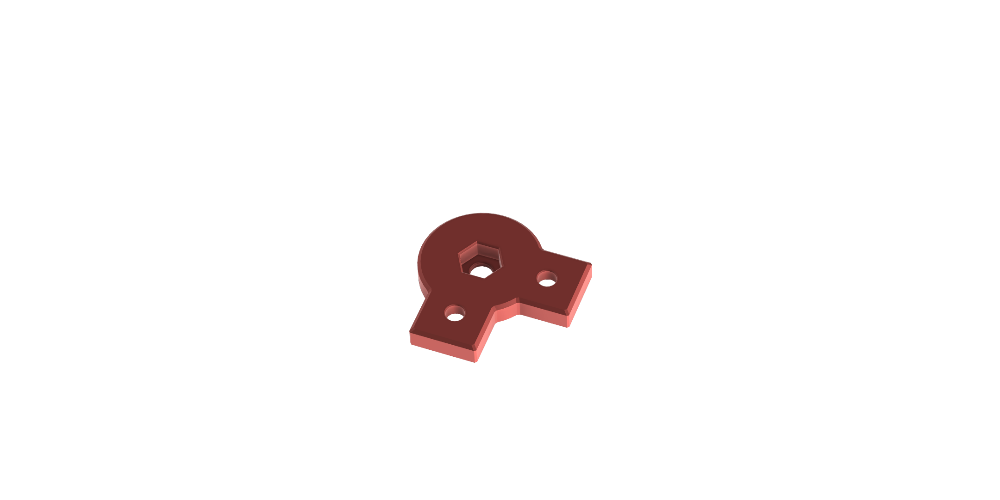
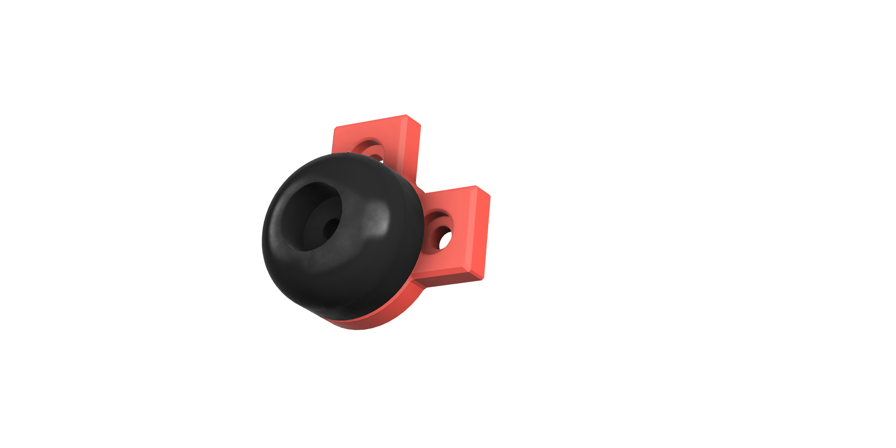

## Print Settings + Bom 

## Print Settings

* Filament type: PETG
* Infill type : Gyroid 
* Support : No
* Brim : No

| Part | Quantity | Layer Height [mm] | Infill [%] | Num. Perimeters | Num. Top / Bottom Layers | 
|:-----|:--------:|:-------------------------:|:----------:|:-------------------:|:--------------------------------:|
| test 1         | 4 | 0.20 | 25| 3 | 5 |                   

## Bom

| Part | Quantity | Screw Length  [mm] | Part Number |
|:-----|:--------:|:-------------------------:|:--------:|
| M5 Screw         | 4 | xxx |  |
| M6 Screw        | 4 | xxx |  |
| M6 Hex Nut        | 4 |  |  |
| Misumi Rubber Feet          | 4 |  | C-30-RK-3617 |

You can buy the Rubber Feet from x
x

